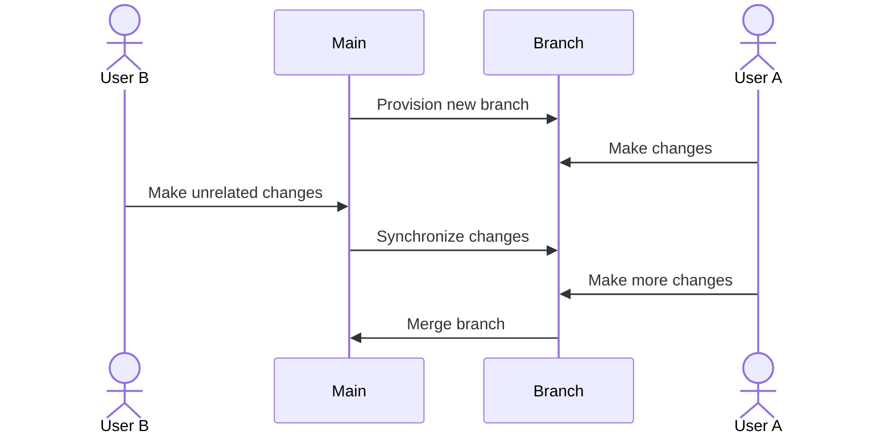
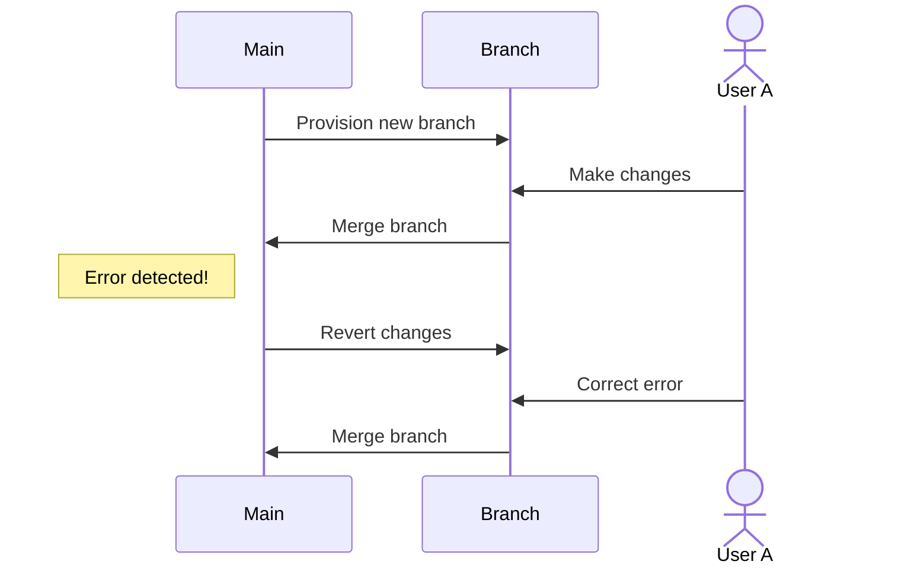

# NetBox Branching

[NetBox](https://github.com/netbox-community/netbox) is the world's leading source of truth for network infrastructure, featuring an extensive and complex data model. But sometimes it can be challenging to orchestrate changes, especially when working within a large team. This plugin introduces a new paradigm for NetBox to help overcome these challenges: branching.

If you're familiar with [git](https://git-scm.com/) or similar version control systems, the concept of branching should be familiar. Essentially, this plugin allows you to make copies of NetBox's data model and alter them independently. Your changes will be reflected only within the branch you're working on, until you decide to merge your branch into the main data model.

This allows you and your colleagues to stage changes within isolated environments and avoid interfering with one another's work or pushing changes to the network prematurely. Each branch can be synchronized as needed to keep up to date with external changes, and merged when needed.

## Features

* Users can create new branches and switch between them seamlessly while navigating the web UI.

* Each branch exists in isolation from its peers: Changes made within one branch won't affect any other branches.

* Standard NetBox permissions are employed to control which users can perform branch operations.

* Branches can be created, synchronized, merged, reverted, and deleted through the REST API.

* No external dependencies! This plugin requires only NetBox v4.1 or later and a conventional PostgreSQL database (v12.0 or later).

## Terminology

* **Main** is shorthand for the primary NetBox state. Any changes made outside the context of a specific branch are made here.

* The creation, modification, or deletion of an object is a **change**.

* A **branch** is an independent copy of the NetBox data model which diverges from main at a set point in time. Any changes to main after that time will not be reflected in the branch. Likewise, changes made within the branch will not be reflected in main.

* Branches are **provisioned** automatically upon creation. The initial state of a branch is identical to the state of main at the time it was provisioned. 

* Changes in main can be **synchronized** at any time into a branch. Branches are independent of one another: Changes must be synchronized into each branch individually. This ensures complete isolation among branches.

* Once the work within a branch has been completed, it can be **merged** into main. Once a branch has been merged, it is generally no longer used.

* Merged changes can be **reverted** provided the branch has not yet been deleted. This effectively replays the changes in reverse order to undo the relevant changes.

## Workflow

The first step is to [create a new branch](./using-branches/creating-a-branch.md). Upon creation, a background job is automatically queued to provision a dedicated PostgreSQL schema for the branch. When provisioning is complete, the branch's status is updated to "ready."

Users can now activate the branch and begin making changes within it. These changes will be contained to the branch, and will not impact main. Likewise, any changes to main will not be reflected in the branch until it has been [synchronized](./using-branches/syncing-merging.md#syncing-a-branch) by a user. A branch may be synchronized repeatedly to keep it up to date with main over time.

> [!TIP]
> If you would like to share the work you've done in a branch with a colleague, you cannot just the URL you're currently viewing.  
> Instead, if you have activated a branch other than main, you will find a `Share` button on each object detail view page. Clicking `Share` will copy a shareable URL that you can send to others.  

Once work in the branch has been completed, it can be [merged](./using-branches/syncing-merging.md#merging-a-branch) into main.



In the event a branch should not have been merged, it can be reverted. Previously merged changes to main will be unwound and the branch will be restored to its pre-merge state. The branch is again marked as ready for additional changes, if needed, and can be merged again.



## Plugin Installation

### 1. Database Preparation

Before installing this plugin, ensure that the PostgreSQL user as which NetBox authenticates has permission to create new schemas in the database. This can be achieved by issuing the following command in the PostgreSQL shell (substituting `$database` and `$user` with their respective values):

```postgresql
GRANT CREATE ON DATABASE $database TO $user;
```

### 2. Virtual Environment

The plugin can be installed from [PyPI](https://pypi.org/project/netboxlabs-netbox-branching/). First, activate the Python virtual environment used by NetBox (which is typically located at `/opt/netbox/venv/`):

```
source /opt/netbox/venv/bin/activate
```

!!! note
    You may need to modify the `source` command above if your virtual environment has been installed in a different location.

### 3. Python Package

Use `pip` to install the Python package:

```
pip install netboxlabs-netbox-branching
```

### 4. Enable Plugin

Add `netbox_branching` to **the end** of the `PLUGINS` list in `configuration.py`.

```python
PLUGINS = [
    # ...
    'netbox_branching',
]
```

!!! warning
    `netbox_branching` must be the **last** (or only) plugin in the list. Branching support will not be registered for models provided by any plugin appearing later in the list.

!!! note
    If there are no plugins already installed, you might need to create this parameter. If so, be sure to define `PLUGINS` as a list _containing_ the plugin name as above, rather than just the name.

### 5. Configuration

#### NetBox v4.3 and Later

Wrap your `DATABASES` configuration parameter with `DynamicSchemaDict` in `configuration.py`, as shown below.

!!! note
    If upgrading from an earlier version of NetBox, you may need to replace the legacy `DATABASE` (singular) parameter with `DATABASES` (plural).

```python
from netbox_branching.utilities import DynamicSchemaDict

DATABASES = DynamicSchemaDict({
    'default': {
        'ENGINE': 'django.db.backends.postgresql',
        'NAME': 'netbox',
        'USER': 'netbox',
        ...
    }
})
```

Additionally, declare `DATABASE_ROUTERS` to employ the plugin's custom database router to support branching.

```python
DATABASE_ROUTERS = [
    'netbox_branching.database.BranchAwareRouter',
]
```

#### NetBox v4.2 and Earlier

If using NetBox v4.2 or earlier, these changes must be made in `local_settings.py`, as the `DATABASES` and `DATABASE_ROUTERS` configuration parameters were not introduced until NetBox v4.3.

Create a file named `local_settings.py` in the same directory as `configuration.py`, and add the following content.
    
```python
from netbox_branching.utilities import DynamicSchemaDict
from .configuration import DATABASE

# Wrap DATABASES with DynamicSchemaDict for dynamic schema support
DATABASES = DynamicSchemaDict({
    'default': DATABASE,
})

# Employ our custom database router
DATABASE_ROUTERS = [
    'netbox_branching.database.BranchAwareRouter',
]
```

### 6. Database Migrations

Run the included database migrations:

```
cd /opt/netbox/netbox
./manage.py migrate
```

## Known Limitations

There are currently a few limitations to the functionality provided by this plugin that are worth highlighting. We hope to address these in future releases.

* **Branches may not persist across minor version upgrades of NetBox.** Users are strongly encouraged to merge or remove all open branches prior to upgrading to a new minor release of NetBox (e.g. from v4.1 to v4.2). This is because database migrations introduced by the upgrade will _not_ be applied to branch schemas, potentially resulting in an invalid state. However, it should be considered safe to upgrade to new patch releases (e.g. v4.1.0 to v4.1.1) with open branches.

* **Open branches will not reflect newly installed plugins.** Any branches created before installing a new plugin will not be updated to support its models. Note, however, that installing a new plugin will generally not impede the use of existing branches. Users are encouraged to install all necessary plugins prior to creating branches. (This also applies to database migrations introduced by upgrading a plugin.)
