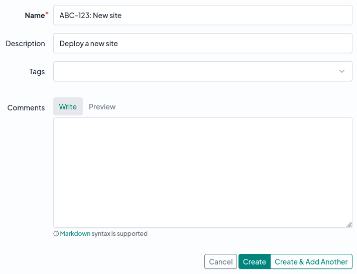
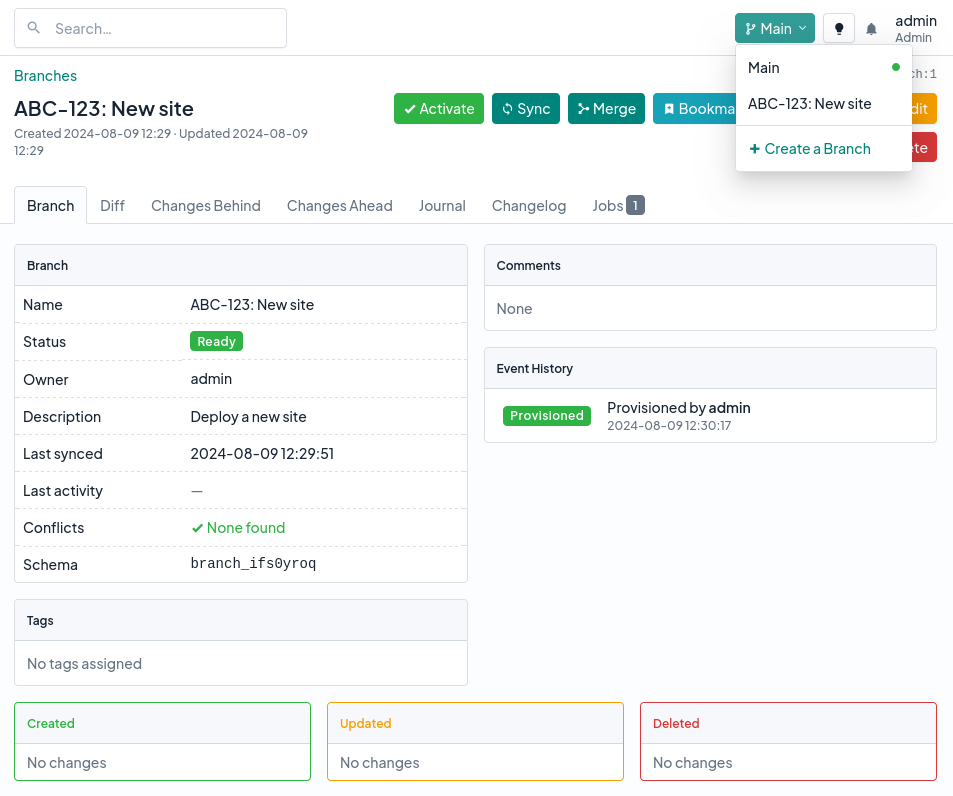

# Creating a Branch

First, navigate to Branching > Branches to view the list of any existing branches. Click the "Add" button at top right to create a new branch.

!!! note
    If you don't see this button, check that you have permission to create a branch.

Pick a unique name for your branch, and add a description if you like.

When a branch is first created, its status will show as "new," indicating that its corresponding PostgreSQL schema has not yet been provisioned in the database. A background job is queued automatically to perform this task, which my take a few seconds to several minutes, depending on the size of your database.

!!! tip
    You can check on the status of the provisioning job under the "Jobs" tab of the branch view.

Once the branch's schema has been provisioned, the status will be updated to "ready," and the branch will become available to activate. You can activate a branch by selecting it from the dropdown menu at top right.

When a branch is active, any changes you make in NetBox (aside from system resources such as users, permissions, etc.) will be reflected only within that branch. For example, if you create a new site when a branch is active, and then switch back to the main branch, the site will no longer appear. Switch back to the original branch, and the site will appear again.

## Branch Details

Within the branch view, you'll notice several tabs. Each of these pertains to a set of changes related to the branch.

* **Diff** - This tab provides a summary of all the objects that have been created, updated, or deleted within the branch.
* **Changes Behind** - This tab lists all changes that have been made in main since the branch was last synchronized. [Synchronizing the branch](./syncing-changes.md) will update it to include these changes.
* **Changes Ahead** - This tab lists all changes made within your branch. [Merging the branch](./merging-a-branch.md) will replicate these changes into main.
* **Merged Changes** - Once a branch has been merged, this tab lists all changes that have been applied from the branch. (This tab appears only for merged branches.)
