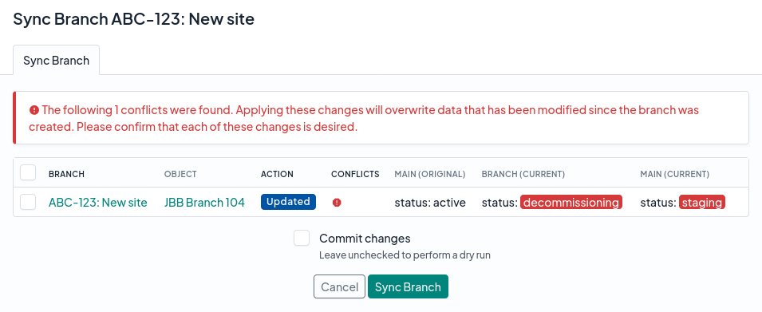

# Syncing & Merging Changes

## Syncing a Branch

Synchronizing a branch replicates all recent changes from main into the branch. These changes can be reviewed under the "Changes Behind" tab under the branch view.

To synchronize a branch, click the "Sync" button. (If this button is not visible, verify that the branch status shows "ready" and that you have permission to synchronize the branch.)

While a branch is being synchronized, its status will show "synchronizing."

!!! tip
    You can check on the status of the syncing job under the "Jobs" tab of the branch view.

## Merging a Branch

Merging a branch replicates all its changes into main, and updates the branch's status to "merged." These changes can be reviewed under the "Changes Ahead" tab under the branch view. Typically, once a branch has been merged, it is no longer used.

To merge a branch, click the "Merge" button. (If this button is not visible, verify that the branch status shows "ready" and that you have permission to merge the branch.)

While a branch is being merged, its status will show "merging."

!!! tip
    You can check on the status of the merging job under the "Jobs" tab of the branch view.

## Dealing with Conflicts

In the event an object has been modified in both your branch _and_ in main in a diverging manner, this will be flagged as a conflict. For example, if both you and another user have modified the description of an interface to two different values in main and in the branch, this represents a conflict.

The good news is that you will be able to proceed with synchronizing or merging your branch even if conflicts exist, however you will need to acknowledge each such conflict to ensure that overwriting the relevant data in your branch with the data from main is acceptable. Do this by selecting each conflict before continuing with the merge.

Alternatively, if the conflicting changes are problematic, you can go back and make the necessary changes in main to avoid overwriting data within your branch.

## Dry Runs

By default, NetBox will perform a "dry run" when synchronizing or merging a branch. This means that it will replicate all the relevant changes to check for errors before ultimately aborting the change and returning the branch to its original state.  To permanently apply these changes instead, check the "commit changes" checkbox.
