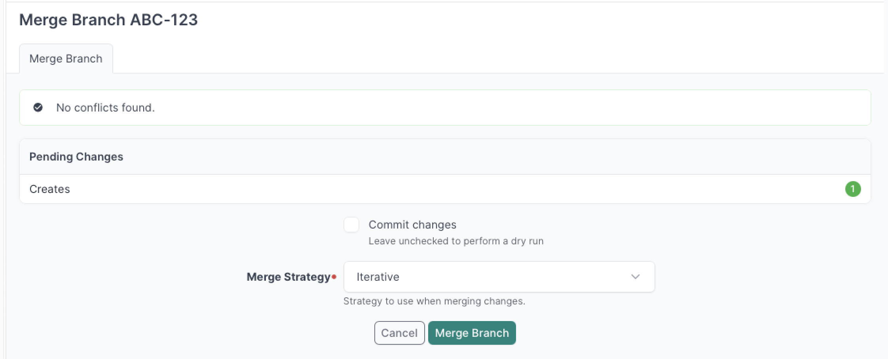
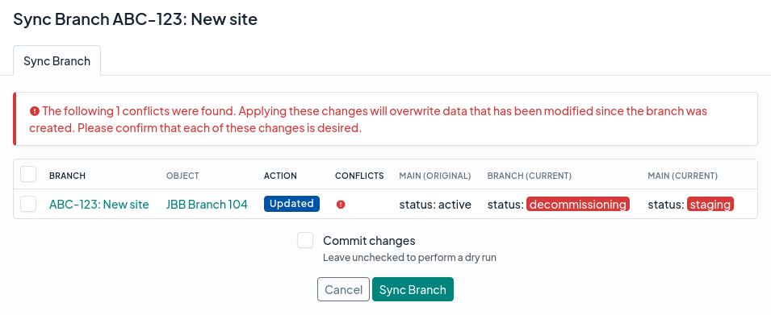

# Syncing & Merging Changes

## Syncing a Branch

Synchronizing a branch replicates all recent changes from main into the branch. These changes can be reviewed under the **Changes Behind** tab of the branch view.

To synchronize a branch, click the **Sync** button. (If this button is not visible, verify that the branch status is "ready" and that you have permission to synchronize the branch.)

!!! warning
    A branch must be synchronized frequently enough to avoid exceeding NetBox's configured [changelog retention period](https://netboxlabs.com/docs/netbox/en/stable/configuration/miscellaneous/#changelog_retention) (which defaults to 90 days). This is to protect against data loss when replicating changes from main. A branch whose `last_sync` time exceeds the configured retention window can no longer be synced. See the [`stale_warning_threshold`](../configuration.md#stale_warning_threshold) configuration parameter for advance warning before a branch becomes stale.

While a branch is being synchronized, its status will show "syncing."

!!! tip
    You can check on the status of the syncing job under the **Jobs** tab of the branch view.

!!! tip
    It is good practice to sync your branch with main immediately before merging. This reduces the chance of conflicts and ensures you are merging against the most current state of main.

## Merging a Branch

Merging a branch replicates its changes into main and updates the branch's status to "merged." These changes can be reviewed under the **Changes Ahead** tab of the branch view. Typically, once a branch has been merged, it is no longer used.

To merge a branch, click the **Merge** button. (If this button is not visible, verify that the branch status is "ready" and that you have permission to merge the branch.) The merge form lets you select a [merge strategy](#merge-strategies) and acknowledge any conflicts before proceeding.

!!! tip
    To grant non-superusers the ability to merge branches, add **Merge branch changes into main** to the **Additional actions** field of an appropriate permission under **Admin > Authentication > Permissions**. Equivalent permissions are available for the **Synchronize**, **Migrate**, **Revert**, and **Archive** actions.



While a branch is being merged, its status will show "merging."

!!! tip
    You can check on the status of the merging job under the **Jobs** tab of the branch view.

Once a branch has been merged, it can be [reverted](./reverting-a-branch.md), archived, or deleted. Archiving a branch removes its associated schema from the PostgreSQL database to reclaim space; an archived branch cannot be reverted, but its event history is retained for future reference.

## Merge Strategies

Both strategies read the same source data: the ObjectChange audit log recorded while you worked inside the branch. The difference is _how_ those records are applied to main.

### Iterative (Default)

The iterative strategy replays every ObjectChange log entry from the branch into main in **chronological order**, one at a time.

```
Branch changelog:
  [1] Create Site A       (User: alice, 09:00)
  [2] Update Device B     (User: bob,   10:15)
  [3] Delete Tenant C     (User: alice, 11:30)

Applied to main:
  Create Site A        → 1 new ObjectChange in main (credited to alice, 09:00)
  Update Device B      → 1 new ObjectChange in main (credited to bob, 10:15)
  Delete Tenant C      → 1 new ObjectChange in main (credited to alice, 11:30)
```

main's changelog contains a full record of every individual change, with the original user and timestamp attribution preserved exactly as they appeared in the branch. This is the default and recommended approach for the vast majority of merges.

Because iterative applies changes exactly as they happened, it can fail in more complex scenarios: an object updated in the branch that was since deleted in main, duplicate objects created independently in both, or temporary intermediate states that violate a constraint even though the branch's final state would be valid. In these cases, squash is typically the right recovery path. See [Best Practices](../best-practices.md) for details.

### Squash

The squash strategy collapses all changes made to each individual object in the branch into a **single operation** before applying anything to main. Instead of replaying the full history of changes, it computes the net effect and applies that. Because only the final state of each object is applied, squash can work around data problems that would cause an iterative merge to fail.

```
Branch changelog:
  [1] Create Site A       (User: alice, 09:00)
  [2] Update Site A       (User: bob,   09:45)
  [3] Update Site A       (User: alice, 10:30)
  [4] Update Device B     (User: bob,   10:15)

Collapsed to:
  Create Site A (final attributes after all updates)
  Update Device B

Applied to main:
  Create Site A   → 1 ObjectChange in main (credited to the user who ran the merge)
  Update Device B → 1 ObjectChange in main (credited to the user who ran the merge)
```

The strategy handles foreign key dependencies automatically: deletes are applied before creates, and object ordering accounts for FK references between objects to avoid constraint violations.

Squash records only the **final state** of each object in main's changelog, attributed to the user who ran the merge. The granular history of who changed what lives only in the branch schema and is lost permanently once the branch is archived or deleted. If a complete audit trail in main matters, use iterative instead.

Squash is a fallback for situations where iterative fails or produces conflicts that can't otherwise be resolved:

- **Iterative fails due to intermediate conflicts** — Squash sidesteps this by only applying the final state, skipping intermediate steps that would have caused problems.
- **Duplicate object recovery** — If identical objects were created in both main and your branch, squash can collapse the CREATE + UPDATE into a single CREATE with the final identifiers. See [Recovering from Duplicate Object Conflicts](#recovering-from-duplicate-object-conflicts) below.
- **Simplifying large branches** — If a branch contains many changes to the same object (e.g. a device updated dozens of times), squash produces a much smaller and cleaner diff in main's changelog.

### Choosing a Strategy

| Situation | Recommended strategy |
|-----------|---------------------|
| Normal merge | Iterative |
| Full audit trail required in main | Iterative |
| Iterative fails with intermediate state errors | Squash |
| Duplicate objects created in both main and branch | Squash |
| Branch contains many redundant changes to the same object | Either; squash produces a cleaner changelog |

When in doubt, try iterative first. If it fails, squash is typically the right recovery path.

### Recovering from Duplicate Object Conflicts

If you find yourself in a situation where identical objects (e.g. sites with the same slug) were created in both main and your branch, the merge will fail due to unique constraint violations. The squash strategy can help you recover:

1. Edit the duplicate object in your branch to use different identifiers (e.g. change the slug from `site_a` to `site_b`)
2. Merge using the squash strategy

Squash will collapse the CREATE and UPDATE into a single CREATE with the new identifiers, allowing the merge to succeed.

## Dealing with Conflicts

In the event an object has been modified in both your branch _and_ in main in a diverging manner, this will be flagged as a conflict. For example, if both you and another user have modified the description of an interface to two different values in main and in the branch, this represents a conflict.



The good news is that you will be able to proceed with synchronizing or merging your branch even if conflicts exist, however you will need to acknowledge each such conflict to ensure that overwriting the relevant data in your branch with the data from main is acceptable. Do this by selecting each conflict before continuing with the merge.

Alternatively, if the conflicting changes are problematic, you can go back and make the necessary changes in main to avoid overwriting data within your branch.

## Dry Runs

By default, NetBox will perform a "dry run" when synchronizing or merging a branch through the web UI. This means that it will replicate all the relevant changes to check for errors before ultimately aborting the operation and returning the branch to its original state. To permanently apply the changes instead, check the **Commit changes** checkbox before submitting the form.

!!! tip
    When using the REST API, the corresponding behavior is controlled by the `commit` parameter, which defaults to `true`. See the [REST API documentation](../rest-api.md#branch-actions) for details.
